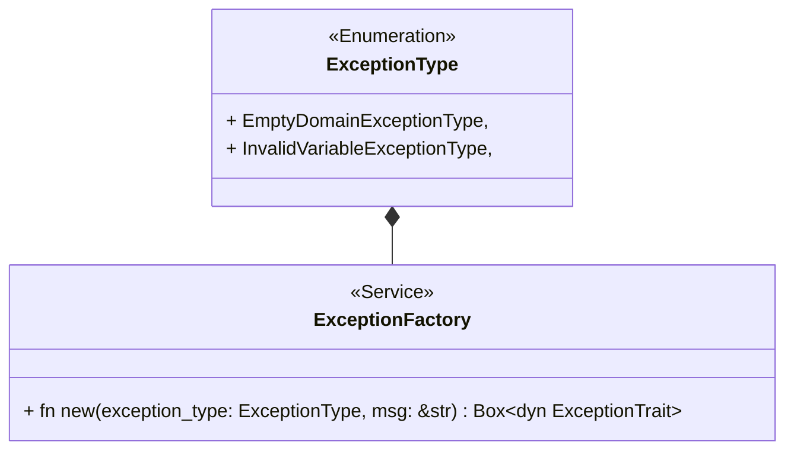
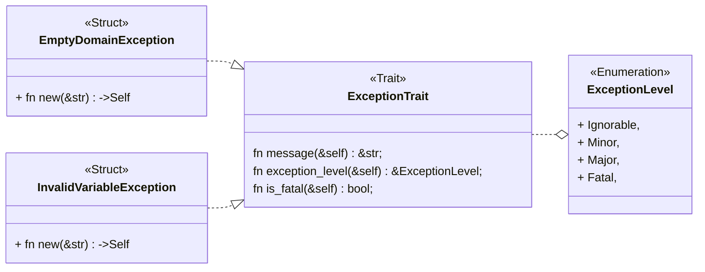

# the class diagram about the *ExceptionFactory*

```mermaid
classDiagram
direction BT

    class ExceptionFactory {
        <<Service>>

        + fn new(exception_type: ExceptionType, msg: &str)  Box~dyn ExceptionTrait~
    }

    ExceptionFactory --* ExceptionType
    
    

    class  ExceptionType {
        <<Enumeration>>
        + EmptyDomainExceptionType,
        + InvalidVariableExceptionType,
    }

```

# the class diagram about the *ExceptionTrait*

```mermaid

classDiagram
direction LR

    class ExceptionTrait {
        <<Trait>>
        fn message(&self)  &str;

        fn exception_level(&self)  &ExceptionLevel;

        fn is_fatal(&self)  bool;
    }


    class ExceptionLevel {
        <<Enumeration>>
        +  Ignorable,
        +  Minor,
        +  Major,
        +  Fatal,
    }

    ExceptionTrait ..o ExceptionLevel


    class InvalidVariableException {
        <<Struct>>
        +  fn new(&str)->Self
    }

    class EmptyDomainException {
        <<Struct>>
        +  fn new(&str)->Self
    }


    EmptyDomainException  ..|>  ExceptionTrait
    InvalidVariableException  ..|>   ExceptionTrait

```