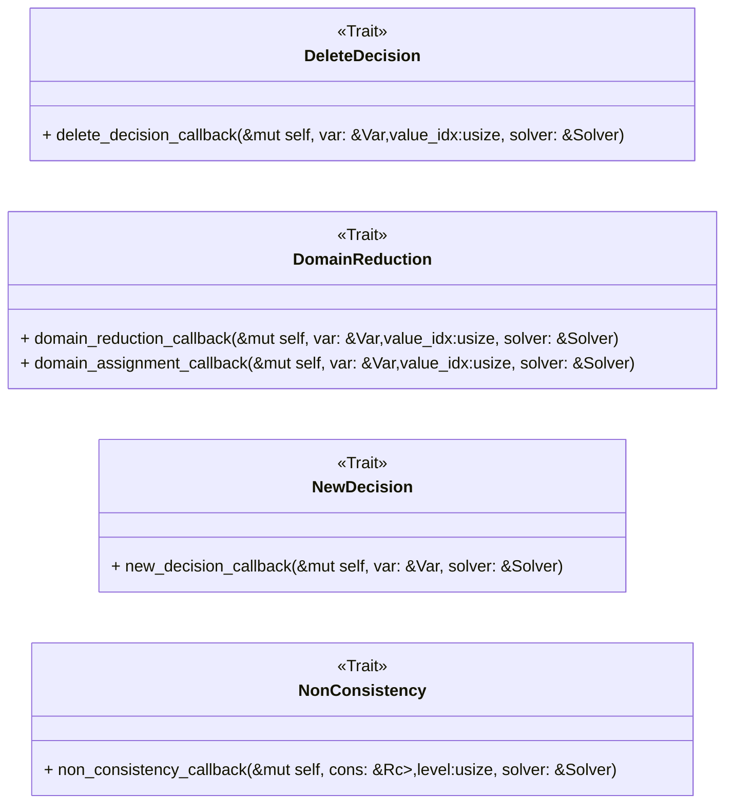

```mermaid
    classDiagram
    direction LR
    
        class DeleteDecision {
            <<Trait>>
           +  delete_decision_callback(&mut self, var: &Var,value_idx:usize, solver: &Solver)
        }
        
        
        class DomainReduction {
            <<Trait>>
            
            +  domain_reduction_callback(&mut self, var: &Var,value_idx:usize, solver: &Solver)
            + domain_assignment_callback(&mut self, var: &Var,value_idx:usize, solver: &Solver)
            }
        
        class NewDecision {
            <<Trait>>
            
            + new_decision_callback(&mut self, var: &Var, solver: &Solver)
        }
     class NonConsistency {
            <<Trait>>
            
              +  non_consistency_callback(&mut self,  cons: &Rc<RefCell<dyn ConstraintTrait>>,level:usize, solver: &Solver)
        }

```