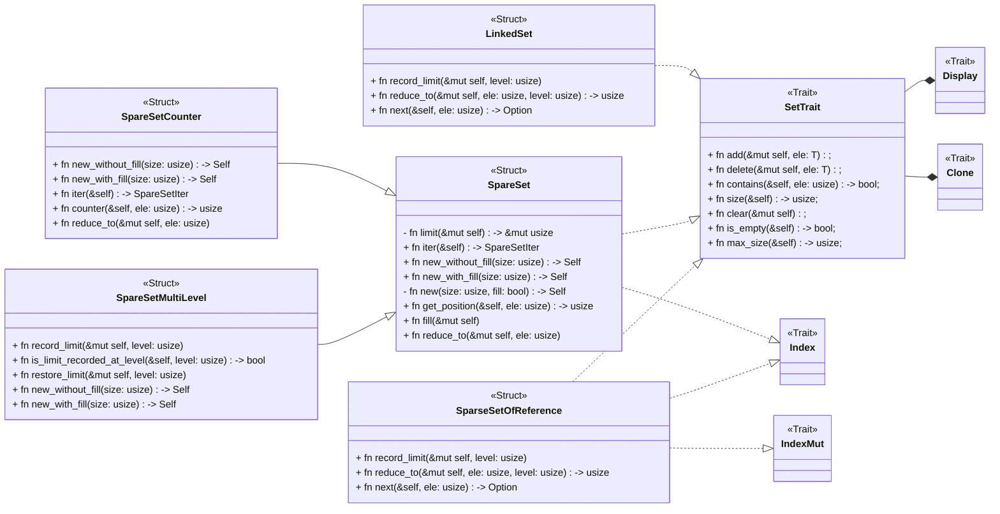

# the class diagram about this mod is following:

```mermaid

classDiagram
direction LR

class Clone {
<<Trait>>
}

    class Display {
        <<Trait>>
    }
    

    SetTrait --* Display
SetTrait --* Clone

    class SetTrait {
        <<Trait>>
        + fn add(&mut self, ele: T);

        + fn delete(&mut self, ele: T);

        +  fn contains(&self, ele: usize) -> bool;

        + fn size(&self) -> usize;

        +  fn clear(&mut self);

        + fn is_empty(&self) -> bool;

        +  fn max_size(&self) -> usize;
    }


   class SparseSetOfReference {
    <<Struct>>
    
    
    + fn record_limit(&mut self, level: usize)
    + fn reduce_to(&mut self, ele: usize, level: usize) -> usize
    + fn next(&self, ele: usize) -> Option<usize>


}
    class LinkedSet {
        <<Struct>>
       
        + fn record_limit(&mut self, level: usize)
        + fn reduce_to(&mut self, ele: usize, level: usize) -> usize
        + fn next(&self, ele: usize) -> Option<usize>
        
    }

    class SpareSetMultiLevel {
        <<Struct>>
    + fn record_limit(&mut self, level: usize) 
    + fn is_limit_recorded_at_level(&self, level: usize) -> bool
    
    + fn restore_limit(&mut self, level: usize)

        + fn new_without_fill(size: usize) -> Self

        + fn new_with_fill(size: usize) -> Self
    }


    class SpareSet {
        <<Struct>>
    - fn limit(&mut self) -> &mut usize 
    
    + fn iter(&self) -> SpareSetIter
    
    + fn new_without_fill(size: usize) -> Self 
    
    + fn new_with_fill(size: usize) -> Self 
    
    - fn new(size: usize, fill: bool) -> Self 
    
    + fn get_position(&self, ele: usize) -> usize 
    
    + fn fill(&mut self)
    
    + fn reduce_to(&mut self, ele: usize) 
    }
    
    class SpareSetCounter {
        <<Struct>>
+ fn new_without_fill(size: usize) -> Self 
    
+ fn new_with_fill(size: usize) -> Self 

+ fn iter(&self) -> SpareSetIter 

+ fn counter(&self, ele: usize) -> usize 

+ fn reduce_to(&mut self, ele: usize) 
    }


    SpareSetCounter  --|>  SpareSet

    SpareSetMultiLevel  --|>  SpareSet
    
    LinkedSet  ..|>   SetTrait

    SpareSet  ..|>   SetTrait

    SparseSetOfReference  ..|>   SetTrait


    class Index {
        <<Trait>>
    }
    class IndexMut {
        <<Trait>>
    }

    SpareSet  ..|>   Index

    SparseSetOfReference  ..|>   IndexMut

    SparseSetOfReference  ..|>   Index

```