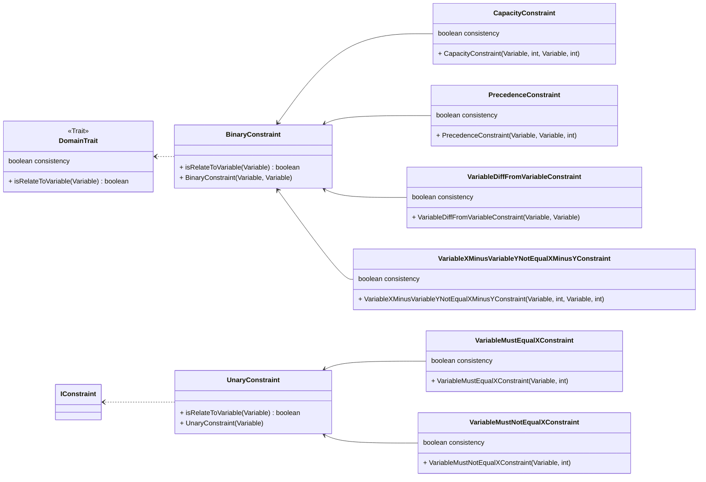

```mermaid
classDiagram
direction RL

    class DomainTrait {
        <<Trait>>
        boolean consistency
        + isRelateToVariable(Variable) boolean
    }
    
    
class BinaryConstraint {
+ isRelateToVariable(Variable) boolean
    + BinaryConstraint(Variable, Variable) 
    }
    
class CapacityConstraint {
boolean consistency
+ CapacityConstraint(Variable, int, Variable, int)
}
     
      class PrecedenceConstraint {
      boolean consistency
    + PrecedenceConstraint(Variable, Variable, int)
      }
      class UnaryConstraint {
    + isRelateToVariable(Variable) boolean
    + UnaryConstraint(Variable)
      }
      class VariableDiffFromVariableConstraint {
      boolean consistency
    + VariableDiffFromVariableConstraint(Variable, Variable)
      }
      class VariableMustEqualXConstraint {
      boolean consistency
    + VariableMustEqualXConstraint(Variable, int)
      }
      class VariableMustNotEqualXConstraint {
      boolean consistency
    + VariableMustNotEqualXConstraint(Variable, int)
      }
      class VariableXMinusVariableYNotEqualXMinusYConstraint {
      boolean consistency
    + VariableXMinusVariableYNotEqualXMinusYConstraint(Variable, int, Variable, int)
      }

BinaryConstraint  ..>  DomainTrait
CapacityConstraint  -->  BinaryConstraint
PrecedenceConstraint  -->  BinaryConstraint
UnaryConstraint  ..>  IConstraint
VariableDiffFromVariableConstraint  -->  BinaryConstraint
VariableMustEqualXConstraint  -->  UnaryConstraint
VariableMustNotEqualXConstraint  -->  UnaryConstraint
VariableXMinusVariableYNotEqualXMinusYConstraint  -->  BinaryConstraint
```