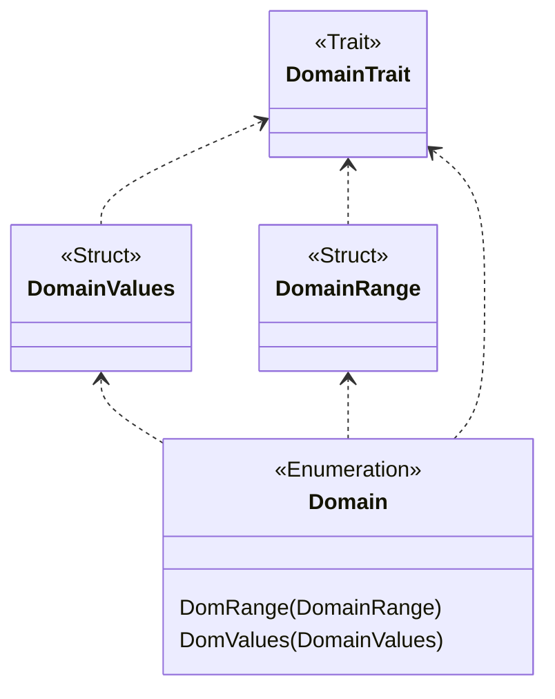

 

```mermaid
    classDiagram
    direction BT
    
        class DomainTrait {
            <<Trait>>
           
        }
        
        
        class DomainRange {
            <<Struct>>
            }
        
        class DomainValues {
            <<Struct>>
        }
    
    
        DomainValues  ..>  DomainTrait
        DomainRange  ..>  DomainTrait
      
    
        class Domain{ 
            <<Enumeration>>
    
            DomRange(DomainRange)
            DomValues(DomainValues)
        }
        
        Domain  ..>  DomainTrait
        Domain ..> DomainValues
        Domain ..> DomainRange

```